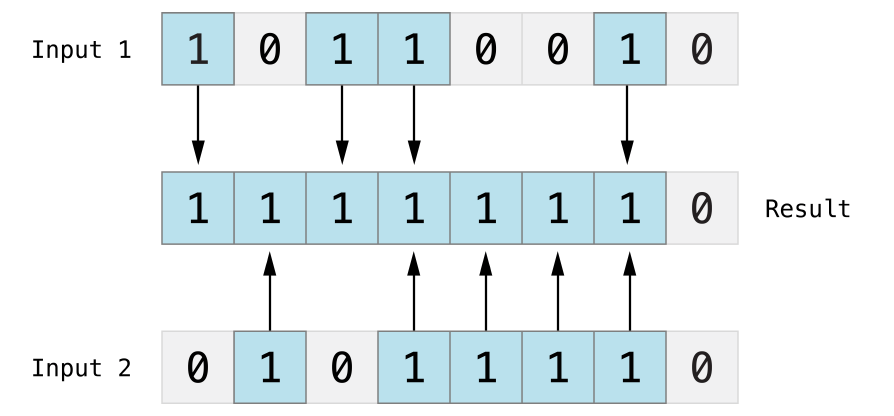
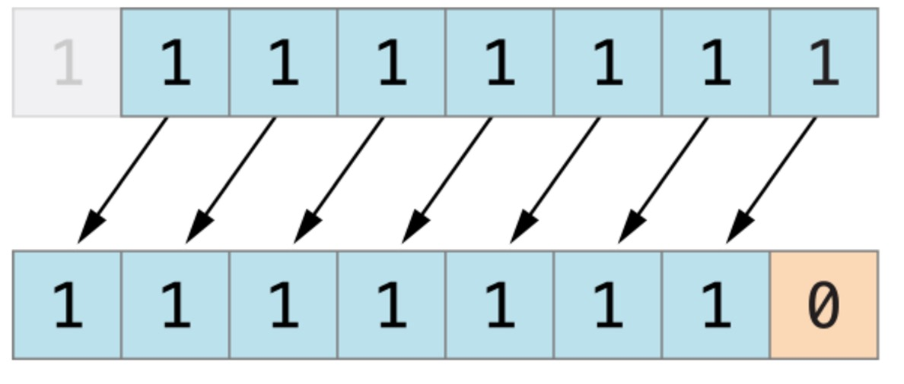
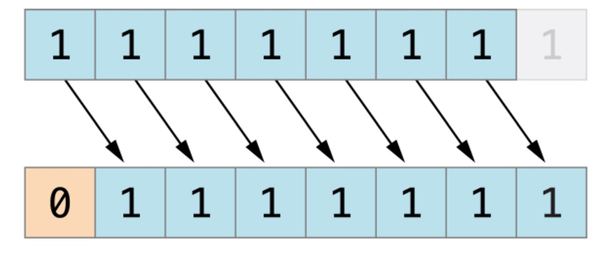

# Swift 运算符

运算符是一个符号，用于告诉编译器执行一个数学或逻辑运算。

Swift 提供了以下几种运算符：

*   算术运算符
*   比较运算符
*   逻辑运算符
*   位运算符
*   赋值运算符
*   区间运算符
*   其他运算符

本章节我们将为大家详细介绍算术运算符、关系运算符、逻辑运算符、位运算符、赋值运算符及其他运算符。

## 算术运算符

以下表格列出了 Swift 语言支持的算术运算符，其中变量 A 为 10，变量 B 为 20：

| 运算符 | 描述 | 实例 |
| --- | --- | --- |
| + | 加号 | A + B 结果为 30 |
| − | 减号 | A − B 结果为 -10 |
| * | 乘号 | A * B 结果为 200 |
| / | 除号 | B / A 结果为 2 |
| % | 求余 | B % A 结果为 0 |
| ++ | 自增 | A++ 结果为 11 |
| -- | 自减 | A-- 结果为 9 |

### 实例

以下为算术运算的简单实例：

```
import Cocoa

var A = 10
var B = 20

print("A + B 结果为：\(A + B)")
print("A - B 结果为：\(A - B)")
print("A * B 结果为：\(A * B)")
print("B / A 结果为：\(B / A)")
A++
print("A++ 后 A 的值为 \(A)")
B--
print("B-- 后 B 的值为 \(B)")

```

以上程序执行结果为：

```
A + B 结果为：30
A - B 结果为：-10
A * B 结果为：200
B / A 结果为：2
A++ 后 A 的值为 11
B-- 后 B 的值为 19

```

## 比较运算符

以下表格列出了 Swift 语言支持的比较运算符，其中变量 A 为 10，变量 B 为 20：

| 运算符 | 描述 | 实例 |
| --- | --- | --- |
| == | 等于 | (A == B) 为 false。 |
| != | 不等于 | (A != B) 为 true。 |
| &gt; | 大于 | (A &gt; B) 为 false。 |
| &lt; | 小于 | (A &lt; B) 为 true。 |
| &gt;= | 大于等于 | (A &gt;= B) 为 false。 |
| &lt;= | 小于等于 | (A &lt;= B) 为 true。 |

### 实例

以下为比较运算的简单实例：

```
import Cocoa

var A = 10
var B = 20

print("A == B 结果为：\(A == B)")
print("A != B 结果为：\(A != B)")
print("A > B 结果为：\(A > B)")
print("A < B 结果为：\(A < B)")
print("A >= B 结果为：\(A >= B)")
print("A <= B 结果为：\(A <= B)")

```

以上程序执行结果为：

```
A == B 结果为：false
A != B 结果为：true
A > B 结果为：false
A < B 结果为：true
A >= B 结果为：false
A <= B 结果为：true

```

## 逻辑运算符

以下表格列出了 Swift 语言支持的逻辑运算符，其中变量 A 为 true，变量 B 为 false：

| 运算符 | 描述 | 实例 |
| --- | --- | --- |
| && | 逻辑与。如果运算符两侧都为 TRUE 则为 TRUE。 | (A && B) 为 false。 |
| &#124;&#124; | 逻辑或。 如果运算符两侧至少有一个为 TRUE 则为 TRUE。 | (A &#124;&#124; B) 为 true。 |
| ! | 逻辑非。布尔值取反，使得true变false，false变true。 | !(A && B) 为 true。 |

以下为逻辑运算的简单实例：

```
import Cocoa

var A = true
var B = false

print("A && B 结果为：\(A && B)")
print("A || B 结果为：\(A || B)")
print("!A 结果为：\(!A)")
print("!B 结果为：\(!B)")

```

以上程序执行结果为：

```
A && B 结果为：false
A || B 结果为：true
!A 结果为：false
!B 结果为：true

```

## 位运算符

位运算符用来对二进制位进行操作，~,&,|,^分别为取反，按位与与，按位与或，按位与异或运算，如下表实例：

| p | q | p & q | p &#124; q | p ^ q |
| --- | --- | --- | --- | --- |
| 0 | 0 | 0 | 0 | 0 |
| 0 | 1 | 0 | 1 | 1 |
| 1 | 1 | 1 | 1 | 0 |
| 1 | 0 | 0 | 1 | 1 |

如果指定 A = 60; 及 B = 13; 两个变量对应的二进制为：

```
A = 0011 1100

B = 0000 1101

```

进行位运算：

| 运算符 | 描述 | 图解 | 实例 |
| --- | --- | --- | --- |
| & | 按位与。按位与运算符对两个数进行操作，然后返回一个新的数，这个数的每个位都需要两个输入数的同一位都为1时才为1。 |  | (A & B) 结果为 12, 二进制为 0000 1100 |
| &#124; | 按位或。按位或运算符&#124;比较两个数，然后返回一个新的数，这个数的每一位设置1的条件是两个输入数的同一位都不为0(即任意一个为1，或都为1)。 |  | (A &#124; B) 结果为 61, 二进制为 0011 1101 |
| ^ | 按位异或. 按位异或运算符^比较两个数，然后返回一个数，这个数的每个位设为1的条件是两个输入数的同一位不同，如果相同就设为0。 |  | (A ^ B) 结果为 49, 二进制为 0011 0001 |
| ~ | 按位取反运算符~对一个操作数的每一位都取反。 |  | (~A ) 结果为 -61, 二进制为 1100 0011 in 2's complement form. |
| &lt;&lt; | 按位左移。左移操作符（&lt;&lt;）将操作数的所有位向左移动指定的位数。 | 下图展示了11111111 &lt;&lt; 1（11111111 左移一位）的结果。蓝色数字表示被移动位，灰色表示被丢弃位，空位用橙色的0填充。 | A &lt;&lt; 2 结果为 240, 二进制为 1111 0000 |
| &gt;&gt; | 按位右移。右移操作符（&lt;&lt;）将操作数的所有位向又移动指定的位数。 | 下图展示了11111111 &gt;&gt; 1（11111111 右移一位）的结果。蓝色数字表示被移动位，灰色表示被丢弃位，空位用橙色的0填充。 | A &gt;&gt; 2 结果为 15, 二进制为 0000 1111 |

以下为位运算的简单实例：

```
import Cocoa

var A = 60  // 二进制为 0011 1100
var B = 13 // 二进制为 0000 1101

print("A&B 结果为：\(A&B)")
print("A|B 结果为：\(A|B)")
print("A^B 结果为：\(A^B)")
print("~A 结果为：\(~A)")

```

以上程序执行结果为：

```
A&B 结果为：12
A|B 结果为：61
A^B 结果为：49
~A 结果为：-61

```

## 赋值运算

下表列出了 Swift 语言的基本赋值运算：

| 运算符 | 描述 | 实例 |
| --- | --- | --- |
| = | 简单的赋值运算，指定右边操作数赋值给左边的操作数。 | C = A + B 将 A + B 的运算结果赋值给 C |
| += | 相加后再赋值，将左右两边的操作数相加后再赋值给左边的操作数。 | C += A 相当于 C = C + A |
| -= | 相减后再赋值，将左右两边的操作数相减后再赋值给左边的操作数。 | C -= A 相当于 C = C - A |
| *= | 相乘后再赋值，将左右两边的操作数相乘后再赋值给左边的操作数。 | C *= A 相当于 C = C * A |
| /= | 相除后再赋值，将左右两边的操作数相除后再赋值给左边的操作数。 | C /= A 相当于 C = C / A |
| %= | 求余后再赋值，将左右两边的操作数求余后再赋值给左边的操作数。 | C %= A is equivalent to C = C % A |
| &lt;&lt;= | 按位左移后再赋值 | C &lt;&lt;= 2 相当于 C = C &lt;&lt; 2 |
| &gt;&gt;= | 按位右移后再赋值 | C &gt;&gt;= 2 相当于 C = C &gt;&gt; 2 |
| &= | 按位与运算后赋值 | C &= 2 相当于 C = C & 2 |
| ^= | 按位异或运算符后再赋值 | C ^= 2 相当于 C = C ^ 2 |
| &#124;= | 按位或运算后再赋值 | C &#124;= 2 相当于 C = C &#124; 2 |

以下为赋值运算的简单实例：

```
import Cocoa

var A = 10
var B = 20
var C = 100

C = A + B
print("C 结果为：\(C)")

C += A
print("C 结果为：\(C)")

C -= A
print("C 结果为：\(C)")

C *= A
print("C 结果为：\(C)")

C /= A
print("C 结果为：\(C)")

//以下测试已注释，可去掉注释测试每个实例
/*
C %= A
print("C 结果为：\(C)")

C <<= A
print("C 结果为：\(C)")

C >>= A
print("C 结果为：\(C)")

C &= A
print("C 结果为：\(C)")

C ^= A
print("C 结果为：\(C)")

C |= A
print("C 结果为：\(C)")
*/

```

以上程序执行结果为：

```
C 结果为：30
C 结果为：40
C 结果为：30
C 结果为：300
C 结果为：30

```

## 区间运算符

Swift 提供了两个区间的运算符。

| 运算符 | 描述 | 实例 |
| --- | --- | --- |
| 闭区间运算符 | 闭区间运算符（a...b）定义一个包含从a到b(包括a和b)的所有值的区间，b必须大于等于a。 ‌ 闭区间运算符在迭代一个区间的所有值时是非常有用的，如在for-in循环中： | 1...5 区间值为 1, 2, 3, 4 和 5 |
| 半开区间运算符 | 半开区间（a..&lt;b）定义一个从a到b但不包括b的区间。 之所以称为半开区间，是因为该区间包含第一个值而不包括最后的值。&lt;="" td=""&gt;&lt;/b）定义一个从a到b但不包括b的区间。&gt; | 1..&lt; 5 区间值为 1, 2, 3, 和 4 |

以下为区间运算的简单实例：

```
import Cocoa

print("闭区间运算符:")
for index in 1...5 {
    print("\(index) * 5 = \(index * 5)")
}

print("半开区间运算符:")
for index in 1..<5 {
    print("\(index) * 5 = \(index * 5)")
}

```

以上程序执行结果为：

```
闭区间运算符:
1 * 5 = 5
2 * 5 = 10
3 * 5 = 15
4 * 5 = 20
5 * 5 = 25
半开区间运算符:
1 * 5 = 5
2 * 5 = 10
3 * 5 = 15
4 * 5 = 20

```

## 其他运算符

Swift 提供了其他类型的的运算符，如一元、二元和三元运算符。

*   一元运算符对单一操作对象操作（如`-a`）。一元运算符分前置运算符和后置运算符，前置运算符需紧跟在操作对象之前（如`!b`），后置运算符需紧跟在操作对象之后（如`i++`）。
*   二元运算符操作两个操作对象（如`2 + 3`），是中置的，因为它们出现在两个操作对象之间。
*   三元运算符操作三个操作对象，和 C 语言一样，Swift 只有一个三元运算符，就是三目运算符（`a ? b : c`）。

| 运算符 | 描述 | 实例 |
| --- | --- | --- |
| 一元减 | 数字前添加 - 号前缀 | -3 或 -4 |
| 一元加 | 数字钱添加 + 号前缀 | +6 结果为 6 |
| 三元运算符 | 条件 ? X : Y | 如果添加为 true ，值为 X ，否则为 Y |

以下为一元、二元、三元的运算的简单实例：

```
import Cocoa

var A = 1
var B = 2
var C = true
var D = false
print("-A 的值为：\(-A)")
print("A + B 的值为：\(A + B)")
print("三元运算：\(C ? A : B )")
print("三元运算：\(D ? A : B )")

```

以上程序执行结果为：

```
-A 的值为：-1
A + B 的值为：3
三元运算：1
三元运算：2

```

## 运算符优先级

在一个表达式中可能包含多个有不同运算符连接起来的、具有不同数据类型的数据对象；由于表达式有多种运算，不同的运算顺序可能得出不同结果甚至出现错误运算错误，因为当表达式中含多种运算时，必须按一定顺序进行结合，才能保证运算的合理性和结果的正确性、唯一性。

优先级从上到下依次递减，最上面具有最高的优先级，逗号操作符具有最低的优先级。

相同优先级中，按结合顺序计算。大多数运算是从左至右计算，只有三个优先级是从右至左结合的，它们是单目运算符、条件运算符、赋值运算符。

基本的优先级需要记住：

*   指针最优，单目运算优于双目运算。如正负号。
*   先乘除（模），后加减。
*   先算术运算，后移位运算，最后位运算。请特别注意：1 &lt;&lt; 3 + 2 & 7 等价于 (1 &lt;&lt; (3 + 2))&7
*   逻辑运算最后计算

| 运算符类型 | 运算符 | 结合方向 |
| --- | --- | --- |
| 表达式运算 | () [] . expr++ expr-- | 左到右 |
| 一元运算符 | & + - ! ~ ++expr --expr \* / % + - &gt;&gt; &lt;&lt; &lt; &gt; &lt;= &gt;= == != | 右到左 |
| 位运算符 | & ^ &#124; && &#124;&#124; | 左到右 |
| 三元运算符 | ?: | 右到左 |
| 赋值运算符 | = += -= \*= /= %= &gt;&gt;= &lt;&lt;= &= ^= &#124;= | 右到左 |
| 逗号 | , | 左到右 |

以下为运算符优先级简单实例：

```
import Cocoa

var A = 0

A = 2 + 3 * 4 % 5
print("A 的值为：\(A)")

```

以上程序执行结果为：

```
A 的值为：4

```

**实例解析：**

根据运算符优先级，可以将以上程序的运算解析为以下步骤，表达式相当于：

```
2 + ((3 * 4) % 5)

```

第一步计算： (3 * 4) = 12，所以表达式相当于：

```
2 + (12 % 5)
```

第二步计算 12 % 5 = 2，所以表达式相当于：

```
2 + 2
```

此时可以容易地看出计算的结果为 4。
