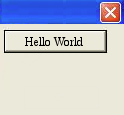
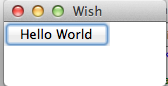

# TK环境设置 - Tk教程

一般所有Mac和Linux MAC配备了预装Tk。如果它不可用，或者需要最新版本，那么可能需要安装它。Windows上没有预装Tcl/Tk，可能需要使用特定的二进制安装它。

## Tk解释器

这仅仅是一个小程序，可以键入Tk命令，并逐行执行。它停止执行的情况下，它遇到错误不能执行编译一个TCL文件。

让我们创建一个 helloWorld.tcl文件，如下所示。运行在选择的平台上的第一个程序。

```
#!/usr/bin/wish

grid [ttk::button .mybutton -text "Hello World"] 
```

下面的部分仅说明如何在每个可用的平台上安装Tcl/Tk。

## 在Windows上安装

从可用有效的Tcl/Tk二进制文件列表下载最新版本的Windows[安装程序](http://www.activestate.com/activetcl/downloads)。活跃的Tcl / Tk社区版可供免费供个人使用。

运行下载的可执行文件安装Tcl和Tk，可以按照屏幕上的说明进行。

现在我们可以构建并切换到包含该文件的文件夹中，然后使用以下步骤运行Tcl文件helloWorld.tcl

```
C:\Tcl> wish helloWorld.tcl
```

按回车键，我们会看到一个输出，如下图所示。



## 在Linux上安装

大多数Linux操作系统自带的内置Tk，可以马上在这些系统使用。在一些情况下，它可能不可用，那可以使用下面的命令来下载和安装Tcl-TK。

```
$ yum install tcl tk
```

现在我们可以构建并通过使用cd命令切换到文件夹包含该文件，然后使用以下步骤运行Tcl文件helloWorld.tcl

```
$ wish helloWorld.tcl
```

按回车键，我们会看到类似以下的输出。



## 在基于Debian的系统安装

在情况下，如果无法提供预建在操作系统，可以使用下面的命令来下载和安装Tcl-TK。

```
$ sudo apt-get install tcl tk
```

现在我们可以构建并通过使用cd命令切换到文件夹包含该文件，然后使用以下步骤来运行一个Tcl文件表示helloWorld.tcl

```
$ wish helloWorld.tcl
```

按回车键，我们会看到类似以下的输出。


## 在Mac OS X安装

从可用有效的Tcl/Tk二进制文件列表下载最新版本的Mac OS X包。有效Tcl社区版可免费供个人使用。

运行下载的可执行文件安装Active Tcl，可以按照屏幕上的说明进行。

现在我们可以构建并通过使用cd命令切换到文件夹包含该文件，然后使用以下步骤运行Tcl文件helloWorld.tcl

```
$ wish helloWorld.tcl
```

按回车键，我们会看到一个输出，如下图所示。


## 从安装源文件

可以从源文件安装时的二进制包不可用的选项。所以一般最好使用Tk的二进制文件适用于Windows和Mac OS X，在UNIX的系统资源所以只有编译如下所示。

*   下载[源文件](http://www.tcl.tk/software/tcltk/download.html)。

*   现在，使用下面的命令来提取，编译和构建切换到下载的文件夹。

```
$ tar zxf tk8.6.1-src.tar.gz
$ cd tcl8.6.1
$ cd unix
$ ./configure —with-tcl=../../tcl8.6.1/unix —prefix=/opt —enable-gcc
$ make
$ sudo make install
```

注：请确保更改文件名，在上面的命令1和2下载的版本。

 