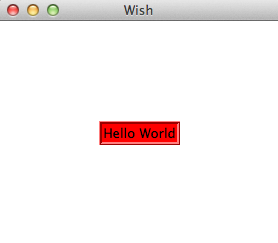

# TK Widget概述 - Tk教程

一个基于Tcl的应用程序的基本组成部分被称为窗口小部件。成分有时也被称为窗口，由于在Tk的“window”和“widget”经常互换使用。 Tk是一个软件包，提供了一组图形组件的丰富来使用Tcl创建图形的应用程序。

TK提供了一系列的部件，从基本的GUI控件如按钮和菜单数据显示窗口小部件。窗口小部件是非常可配置的，因为它们的默认配置使它们易于使用。

Tk程序遵循一个部件widget的层次结构，其中任何数量的部件可以被放置在另一小窗口，并在另一小窗口的部件。在一个Tk的程序所述主窗口部件被称为根部件，并且可以通过使TkRoot类的新实例被创建。

## 创建一个小部件

创建插件widget语法下面给出。

```
type variableName arguments options
```

这里的类型指的是按钮，标记等小部件的类型。参数是可选的，并且基于每个widget语法所必需的。选项范围大小到每个组件的格式。

## Widget 命名约定

Widget使用类似命名的包结构。Tk的根窗口被命名为用句点（.）和在窗口中的元素，例如按钮命名.myButton1。变量名称应该以小写字母，数字或标点符号（除了一个时期）。第一个字符后，其它字符可以是大写或小写字母，数字或标点符号（除了时间）。建议使用小写字母开始的标签。

## 颜色命名约定

颜色可以使用名称，如red, green等声明。它也可以用十六进制表示与＃。十六进制数字的数目可以是3,6，9或12。

## 维度约定

默认单位是像素，它是用来当指定大小。其他尺寸i表示英寸，m表示毫米，c表示厘米，以及p表示点。

## 常用选项

有提供给所有的部件，以便许多共同的选项和它们被列于下表中。

| SN | 语法 | 描述 |
| --- | --- | --- |
| 1 | **-background color** | 用于设置小部件背景色。 |
| 2 | **-borderwidth width** | 用于绘制在3D效果边界。 |
| 3 | **-font fontDescriptor** | 用来设置部件字体。 |
| 4 | **-foreground color** | 用于设置部件的前景色。 |
| 5 | **-height number** | 用于设置部件高度。 |
| 6 | **-highlightbackground color** | 用于设置颜色矩形周围画一个小部件时，窗口小部件不具有输入焦点。 |
| 7 | **-highlightcolor color** | 用于设置颜色矩形周围画一个小部件时，窗口小部件有输入焦点。 |
| 8 | **-padx number** | 设置padx的部件。 |
| 9 | **-pady number** | 设置pady的部件。 |
| 10 | **-relief condition** | 设置这个小程序的3D浮雕。条件得到提升，凹陷，扁平，起垄，固体或凹槽。 |
| 11 | **-text text** | 设置小部件的文本。 |
| 12 | **-textvariable varName** | 变量与小部件关联。当小部件的文本改变，该变量设置控件的文本。 |
| 13 | **-width number** | 设置widget的宽度。 |

一个简单的例子选择如下所示。

```
#!/usr/bin/wish

grid [label .myLabel -background red -text "Hello World" -relief ridge -borderwidth 3] -padx 100 -pady 100
```

当我们运行上面的程序，会得到下面的输出。



可用窗口小部件的列表如下分类。

## 基础widgets

| SN | Widget | 描述 |
| --- | --- | --- |
| 1 | **Label** | 窗口小部件，用于显示文本的单行。 |
| 2 | **Button** | 小部件是可以点击的，并触发一个动作。 |
| 3 | **Entry** | 窗口小部件用于接受文字输入的一行。 |
| 4 | **Message** | 小部件显示多行文本。 |
| 5 | **Text** | 小部件显示和可选编辑多行文本。 |
| 6 | **Toplevel** | 由窗口管理器提供的所有边框和装饰。 |

## widgets布局

| SN | Widget | 描述 |
| --- | --- | --- |
| 1 | **Frame** | 容器部件持有其他部件。 |
| 2 | **Place** | 窗口小部件持有特定的地方的其他部件，其起源坐标和精确的尺寸。 |
| 3 | **Pack** | 简单的小工具，以将它们放置在父控件之前组织块部件。 |
| 4 | **Grid** | 窗口小部件嵌套小部件包装在不同的方向。 |

## 选择widgets

| SN | Widget | 描述 |
| --- | --- | --- |
| 1 | **Radiobutton** | 窗口小部件具有一组开/关按钮和标签，其中一个可被选择。 |
| 2 | **Checkbutton** | 窗口小部件具有一组开/关按钮和标签，其中许多可被选择. |
| 3 | **Menu** | 窗口小部件为菜单项充当支架。 |
| 4 | **Listbox** | 窗口小部件，显示一个或多个单元格，其中的列表可以被选择。 |

## 大型widgets

| SN | Widget | 描述 |
| --- | --- | --- |
| 1 | **Dialog** | 部件显示对话框。 |
| 2 | **Spinbox** | 窗口小部件允许用户选择数字。 |
| 3 | **Combobox** | 窗口小部件，它结合了可供利用的选择列表中的一个条目。 |
| 4 | **Notebook** | 标签窗口小部件，有助于几个页面之一之间切换，使用索引选项卡。 |
| 5 | **Progressbar** | 窗口小部件提供视觉反馈的一个长期操作，如文件上传进度。 |
| 6 | **Treeview** | 窗口小部件用来显示，并允许通过项目的层次结构浏览更多的树的形式。 |
| 7 | **Scrollbar** | 滚动部件没有文字或canvas小部件。 |
| 8 | **Scale** | 缩放小部件选择通过滑块的数值。 |

## 其它 widgets

| SN | Widget | 描述 |
| --- | --- | --- |
| 1 | **Canvas** | 绘制部件显示图形和图像.. |

我们将介绍有关各窗口小部件在下几个章节。

 