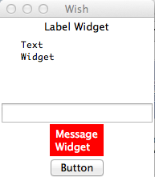

# TK 基本Widget - Tk教程

基本部件widget是在几乎所有的Tk应用程序中提供常用的小工具。可用的基本部件的列表如下所示。

| 1 | **[Label](http://www.yiibai.com/tcl-tk/tk_label_widget.html)** | 窗口小部件，用于显示文本的单行。 |
|:--- |:--- |
| 2 | **[Button](http://www.yiibai.com/tcl-tk/tk_button_widget.html)** | 小部件是可以点击的，并触发一个动作。 |
| 3 | **[Entry](http://www.yiibai.com/tcl-tk/tk_entry_widget.html)** | 窗口小部件用于接受文字输入的一行。 |
| 4 | **[Message](http://www.yiibai.com/tcl-tk/tk_message_widget.html)** | 小部件显示多行文本。 |
| 5 | **[Text](http://www.yiibai.com/tcl-tk/tk_text_widget.html)** | 小部件显示和可选编辑多行文本。 |
| 6 | **[Toplevel](http://www.yiibai.com/tcl-tk/tk_toplevel_widget.html)** | 窗口小部件用于创建一个帧是一个新的顶层窗口。 |

一个简单Tk的示例如下所示使用基本部件。

```
#!/usr/bin/wish

grid [label .myLabel -text "Label Widget" -textvariable labelText] 
grid [text .myText -width 20 -height 5]
.myText insert 1.0 "Text\nWidget\n"
grid [entry .myEntry -text "Entry Widget"]
grid [message .myMessage -background red -foreground white -text "Message\nWidget"]
grid [button .myButton1  -text "Button" -command "set labelText clicked"]

```

当我们运行上面的程序，会得到下面的输出。

   