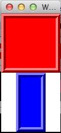

# TK Widget布局 - Tk教程

布局部件被用于处理Tk应用程序布局。Frame控件是用来组其他部件和位置，包装和网格是布局管理器，完全控制添加到Windows。可用布局窗口小部件的列表，如下所示。

| 1 | **[Frame](http://www.yiibai.com/tcl-tk/tk_frame_widget.html)** | 容器部件持有其他部件。 |
|:--- |:--- |
| 2 | **[Place](http://www.yiibai.com/tcl-tk/tk_place_widget.html)** | 窗口小部件持有特定的地方的其他部件，其起源坐标和精确的尺寸。 |
| 3 | **[Pack](http://www.yiibai.com/tcl-tk/tk_pack_widget.html)** | 简单的小工具，以将它们放置在父控件之前组织块部件。 |
| 4 | **[Grid](http://www.yiibai.com/tcl-tk/tk_grid_widget.html)** | 窗口小部件嵌套小部件包装在不同的方向。 |

一个简单的Tk的部件布局示例，如下所示。

```
#!/usr/bin/wish

frame .myFrame1 -background red  -relief ridge -borderwidth 8 -padx 10 -pady 10  -height 100 -width 100
frame .myFrame2 -background blue  -relief ridge -borderwidth 8 -padx 10 -pady 10  -height 100 -width 50
pack .myFrame1 
pack .myFrame2

```

当我们运行上面的程序，会得到下面的输出。

   