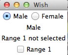

# TK选择Widget - Tk教程

选择窗口小部件用于选择在一个Tk应用程序不同的选项。可用的选择窗口小部件的列表，如下所示。

| 1 | **[Radiobutton](http://www.yiibai.com/tcl-tk/tk_radio_button_widget.html)** | 窗口小部件具有一组开/关按钮和标签，其中一个可被选择 |
|:--- |:--- |
| 2 | **[Checkbutton](http://www.yiibai.com/tcl-tk/tk_check_button_widget.html)** | 窗口小部件具有一组开/关按钮和标签，其中许多可被选择。 |
| 3 | **[Menu](http://www.yiibai.com/tcl-tk/tk_menu_widget.html)** | 窗口小部件为菜单项充当支架。 |
| 4 | **[Listbox](http://www.yiibai.com/tcl-tk/tk_listbox_widget.html)** | 窗口小部件，显示一个或多个单元格，其中的列表可以被选择。 |

一个简单的Tk选择部件使用的示例如下所示。

```
#!/usr/bin/wish

grid [frame .gender ]
grid [label .label1  -text "Male" -textvariable myLabel1 ] 
grid [radiobutton .gender.maleBtn -text "Male"   -variable gender -value "Male" -command "set  myLabel1 Male"] -row 1 -column 2
grid [radiobutton .gender.femaleBtn -text "Female" -variable gender -value "Female" -command "set  myLabel1 Female"] -row 1 -column 3
.gender.maleBtn select
grid [label .myLabel2  -text "Range 1 not selected" -textvariable myLabelValue2 ] 
grid [checkbutton .chk1 -text "Range 1" -variable occupied1 -command {if {$occupied1 } {
   set myLabelValue2 {Range 1 selected}
} else {
   set myLabelValue2 {Range 1 not selected}
} }]
proc setLabel {text} {
    .label configure -text $text 
}
```

当我们运行上面的程序，会得到下面的输出。

   