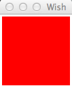
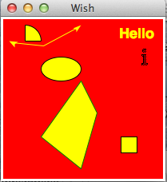

# Tk Canvas Widget - Tk教程

Canvas 用于提供画图区。Canvas 组件的语法如下所示。

```
canvas canvasName options
```

## 选项

可用于canvas widget的选项列于下表中。

| SN | 语法 | 描述 |
| --- | --- | --- |
| 1 | **-background color** | 用于设置小部件背景色。 |
| 2 | **-closeenough distance** | 设置鼠标光标移动到一个可显示项目接近程度。默认值是1.0像素。该值可以是一个分数，并必须为正。 |
| 3 | **-scrollregion boundingBox** | 所述边界框为这个画布canvas的总面积。 |
| 4 | **-height number** | 用于设置部件widget的高度。 |
| 5 | **-width number** | 设置widget的宽度。 |
| 6 | **-xscrollincrement size** | 用于滚动请求水平滚动的数量值。 |
| 7 | **-yscrollincrement size** | 垂直滚动时，滚动请求数量值。 |

一个简单的例子canvas widget如下所示。

```
#!/usr/bin/wish

canvas .myCanvas -background red -width 100 -height 100 
pack .myCanvas
```

当我们运行上面的程序，会得到下面的输出。



## Widget小工具在canvas上绘图

可用小部件在画布canvas上绘制列表如下。

| SN | Widget | 描述 |
| --- | --- | --- |
| 1 | **[Line](http://www.yiibai.com/tcl-tk/tk_canvas_line.html)** | 绘制一条线。 |
| 2 | **[Arc](http://www.yiibai.com/tcl-tk/tk_canvas_arc.html)** | 绘制弧形。 |
| 3 | **[Rectangle](http://www.yiibai.com/tcl-tk/tk_canvas_rectangle.html)** | 绘制一个矩形。 |
| 4 | **[Oval](http://www.yiibai.com/tcl-tk/tk_canvas_oval.html)** | 绘制一个椭圆。 |
| 5 | **[Polygon](http://www.yiibai.com/tcl-tk/tk_canvas_polygon.html)** | 绘制多边形。 |
| 6 | **[Text](http://www.yiibai.com/tcl-tk/tk_canvas_text.html)** | 绘制文本。 |
| 7 | **[Bitmap](http://www.yiibai.com/tcl-tk/tk_canvas_bitmap.html)** | 绘制一个位图。 |
| 8 | **[Image](http://www.yiibai.com/tcl-tk/tk_canvas_image.html)** | 绘制图像。 |

使用不同的canvas widgets 的一个例子如下所示。

```
#!/usr/bin/wish

canvas .myCanvas -background red -width 200 -height 200 
pack .myCanvas
.myCanvas create arc 10 10 50 50 -fill yellow
.myCanvas create line 10 30 50 50 100 10 -arrow both -fill yellow -smooth true -splinesteps 2
.myCanvas create oval 50 50 100 80 -fill yellow
.myCanvas create polygon 50 150 100 80 120 120 100 190 -fill yellow -outline green
.myCanvas create rectangle 150 150 170 170  -fill yellow
.myCanvas create text 170 20 -fill yellow -text "Hello" -font {Helvetica -18 bold}
.myCanvas create bitmap 180 50 -bitmap info
```

当我们运行上面的程序，会得到下面的输出。

   