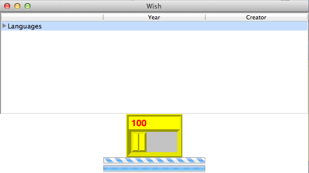

# TK 大型Widget - Tk教程

大型部件，其中包括许多复杂的部件是经常需要在一些大型Tk的应用。可用大型部件的列表，如下所示。

| SN | Widget | 描述 |
| --- | --- | --- |
| 1 | **[Dialog](http://www.yiibai.com/tcl-tk/tk_dialog_widget.html)** | 小部件显示对话框。 |
| 2 | **[Spinbox](http://www.yiibai.com/tcl-tk/tk_spinbox_widget.html)** | 小工具，允许用户选择数字。 |
| 3 | **[Combobox](http://www.yiibai.com/tcl-tk/tk_combobox_widget.html)** | 窗口小部件，它结合了可供利用的选择列表中的一个条目。 |
| 4 | **[Notebook](http://www.yiibai.com/tcl-tk/tk_notebook_widget.html)** | 标签窗口小部件，有助于几个页面之一之间切换，使用索引选项卡。 |
| 5 | **[Progressbar](http://www.yiibai.com/tcl-tk/tk_progressbar_widget.html)** | 窗口小部件提供视觉反馈的一个长操作，如文件上传进度。 |
| 6 | **[Treeview](http://www.yiibai.com/tcl-tk/tk_treeview_widget.html)** | 窗口小部件来显示，并允许通过项目的层次结构浏览更多的树的形式。 |
| 7 | **[Scrollbar](http://www.yiibai.com/tcl-tk/tk_scrollbar_widget.html)** | 滚动部件不带文字或canvas小部件。 |
| 8 | **[Scale](http://www.yiibai.com/tcl-tk/tk_scale_widget.html)** | 缩放小部件选择通过滑块的数值。 |

一个简单的Tk的使用一些大型部件的示例如下所示。

```
#!/usr/bin/wish

ttk::treeview .tree -columns "Creator Year" -displaycolumns "Year Creator" 
.tree heading Creator -text "Creator" -anchor center
.tree heading Year -text "Year" -anchor center
pack .tree
.tree insert {} end -id Languages -text "Languages"
.tree insert Languages end -text C -values [list "Dennis Ritchie" "1990"]
proc scaleMe {mywidget scaleValue} {
	$mywidget configure -length $scaleValue
} 
pack [scale .s2  -from 100.0 -to 200.0 -length 100 -background yellow -borderwidth 5 -font {Helvetica -18 bold} -foreground red -width 40 -relief ridge -orien horizontal -variable a -command "scaleMe .s2" ]
pack [ttk::progressbar .p1 -orient horizontal -length 200 -mode indeterminate -value 90]
pack [ttk::progressbar .p2 -orient horizontal -length 200 -mode determinate -variable a -maximum 75 -value 20]
```

当我们运行上面的程序，会得到下面的输出。

   