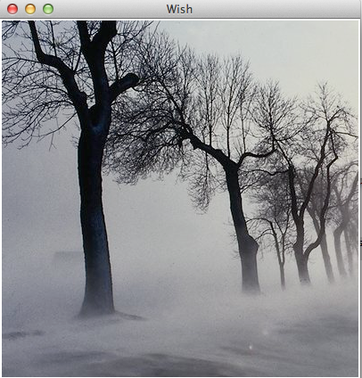

# TK图片 - Tk教程

图像小部件，用于创建和处理图像。创建图像的语法如下。

```
image create type name options
```

另外，在上述的语法类型是照片、位图或名称是图像标识符。

## 选项

可用于图像的选项创建列于下表中。

| SN | 语法 | 描述 |
| --- | --- | --- |
| 1 | **-file fileName** | 图像文件名的名称。 |
| 2 | **-height number** | 用于设置部件widget的高度。 |
| 3 | **-width number** | 设置widget的宽度。 |
| 4 | **-data string** | 图像中基本64编码字符串。 |

一个简单图像小部件的例子如下所示。

```
#!/usr/bin/wish

image create photo imgobj -file "/Users/rajkumar/Desktop/F Drive/pictur/vb/Forests/680049.png" -width 400 -height 400 
pack [label .myLabel]
.myLabel configure -image imgobj 
```

当我们运行上面的程序，会得到下面的输出。



可用函数用于图像列于下表中。

| SN | 语法 | 描述 |
| --- | --- | --- |
| 1 | **image delete imageName** | 删除从存储器和相关的小窗口在视觉上的图像。 |
| 2 | **image height imageName** | 返回高度的图像。 |
| 3 | **image width imageName** | 返回图像的宽度。 |
| 4 | **image type imageName** | 返回图像的类型。 |
| 5 | **image names** | 返回存在存储器中的图像列表。 |

一个简单的例子，使用上面图像小部件的命令如下所示。

```
#!/usr/bin/wish

image create photo imgobj -file "/Users/rajkumar/images/680049.png" -width 400 -height 400 
pack [label .myLabel]
.myLabel configure -image imgobj
puts [image height imgobj]
puts [image width imgobj]
puts [image type imgobj]
puts [image names]
image delete imgobj
```

图像将视觉和记忆，一旦“image delete imgobj”命令执行删除。在控制台，输出会像下面。

```
400
400
photo
imgobj ::tk::icons::information ::tk::icons::error ::tk::icons::warning ::tk::icons::question
```

 