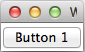
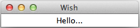
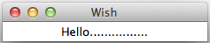

# TK事件 - Tk教程

事件是最简单的形式与命令的交互处理过程。一个简单的例子，事件处理-按钮事件，如下图所示。

```
#!/usr/bin/wish

proc myEvent { } {
puts "Event triggered"
}
pack [button .myButton1  -text "Button 1"   -command myEvent]
```

当我们运行上面的程序，会得到下面的输出。



一个简单的程序，以显示延迟的文字动画事件如下所示。

```
#!/usr/bin/wish

proc delay {} {
 for {set j 0} {$j < 100000} {incr j} {
   } 
}
label .myLabel -text "Hello................" -width 25
pack .myLabel
set str "Hello................"
for {set i [string length $str]} {$i > -2} {set i [expr $i-1]} {
   .myLabel configure -text [string range $str 0 $i]
   update
   delay
}
```

当我们运行程序，会得到动画如下面的输出。



## 延后事件

延后事件的语法如下所示。

```
after milliseconds number command
```

一个简单的程序，以显示如下图所示延迟事件之后。

```
#!/usr/bin/wish

proc addText {} {
 label .myLabel -text "Hello................" -width 25
 pack .myLabel
}
after 1000 addText
```

当我们运行程序，将在一秒钟后得到以下输出。



可以在使用后，取消命令，如下图所示取消的事件。

```
#!/usr/bin/wish

proc addText {} {
 label .myLabel -text "Hello................" -width 25
 pack .myLabel
}
after 1000 addText
after cancel addText
```

## 事件绑定

事件绑定的语法如下所示。

```
bind arguments 
```

## 键盘事件的例子

```
#!/usr/bin/wish

bind .  {puts "Key Pressed: %K "}
```

当我们运行程序，并按下一个字母X，会得到下面的输出。

```
Key Pressed: X 
```

## 鼠标事件的例子

```
#!/usr/bin/wish

bind .  {puts "Button %b Pressed : %x %y "}
```

当我们运行程序，并按下鼠标左键，会得到类似以下的输出。

```
Button 1 Pressed : 89 90 
```

## 具有按钮事件例如链接

```
#!/usr/bin/wish

proc myEvent { } {
puts "Event triggered"
}
pack [button .myButton1  -text "Button 1"   -command myEvent]
bind .  ".myButton1 invoke"
```

当我们运行程序，然后按回车，会得到下面的输出。

```
Event triggered
```

 