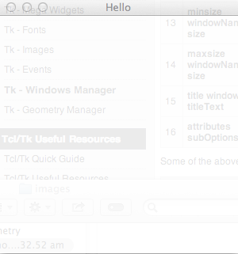
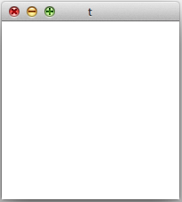

# TK窗口管理器 - Tk教程

窗口管理器是用来处理顶层窗口。它有助于在控制大小，位置和窗口的其他属性。在传统知识。用于指主窗口。窗口命令的语法如下所示。

```
wm option window arguments
```

可用于Tk wm命令选项的列表如下表所示。

| SN | 语法 | 描述 |
| --- | --- | --- |
| 1 | **aspect windowName a b c d** | 尽量保持width/height的比率是a/b 和 c/d之间。 |
| 2 | **geometry windowName geometryParams** | 用于设置几何窗口。 |
| 3 | **grid windowName w h dx dy** | 设置网格的大小。 |
| 4 | **group windowName leaderName** | leaderName给出了一组相关的窗口 |
| 5 | **deiconify windowName** | 使画面正常，如果是最小化。 |
| 6 | **iconify windowName** | 最小化窗口。 |
| 7 | **state windowName** | 返回窗口的当前状态。 |
| 8 | **withdraw windowName** | 将取消该窗口，并在内存中删除其详细信息。 |
| 9 | **iconbitmap windowName image** | 设置或返回图标位图。 |
| 10 | **iconPhoto windowName image** | 设置或返回图标照片。 |
| 11 | **command windowName commandString** | 记录WM_COMMAND属性启动命令。 |
| 12 | **protocol windowName arguments** | 寄存器命令来处理协议请求名称，这可以是WM_DELETE_WINDOW, WM_SAVE_YOURSELF, WM_TAKE_FOCUS. Eg: wm协议。 WM_DELETE_WINDOW退出 |
| 13 | **minsize windowName size** | 确定最小窗口尺寸。 |
| 14 | **maxsize windowName size** | 确定最大窗口大小。 |
| 15 | **title windowName titleText** | 确定用于窗口的标题。 |
| 16 | **attributes subOptions** | 很多可用的如，字母，全屏等属性。 |

上述的一些命令被用在下面的例子。

```
#!/usr/bin/wish

wm maxsize . 800 800
wm minsize . 300 300
wm title . "Hello"
wm attributes . -alpha ".90" 
wm geometry . 300x200+100+100
```

当我们运行上面的程序，会得到下面的输出。



正如所看到alpha是可用的属性之一。常用子命令的列表在下面列出。

| SN | 语法 | 描述 |
| --- | --- | --- |
| 1 | **-alpha number** | 设置字母窗口。 |
| 2 | **-fullscreen number** | 数字可以是：0-正常屏幕或1-全屏。 |
| 3 | **-topmost number** | 设置或返回窗口topmost.Value是否为0或1。 |

## 创建窗口

我们可以使用顶层命令用来创建一个窗口和一个示例如下所示。

```
#!/usr/bin/wish

toplevel .t
```

当我们运行上面的程序，会得到下面的输出。



## 销毁窗口

我们可以用destroy命令销毁的窗口和一个示例如下所示。

```
#!/usr/bin/wish

destroy .t
```

上面的命令会销毁名为.t的窗口。

 