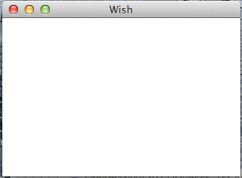
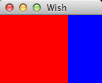

# TK几何图形管理器 - Tk教程

几何图形管理器用于管理窗口和其他框架的几何形状。我们可以用它来处理的窗口和框架的位置和大小。布局部件被用于此目的。

## 定位和尺寸

窗口的定位和大小的语法如下所示。

```
wm geometry . wxh+/-x+/-y
```

在这里，w特是指宽度和h指高度。其次是一个“+”或“ - ”符号与下一个编号参照在屏幕上的x位置。同样地，下面的“+”或“ - ”符号及使用的数字是指在屏幕上的y位置

一个简单的例子显示如下上述。

```
#!/usr/bin/wish

wm geometry . 300x200+100+100
```

当我们运行上面的程序，会得到下面的输出。



## 网格几何图形

网格几何的语法如下所示。

```
grid gridName -column number -row number -columnspan number -rowspan number
```

column, row, columnspan, rowspan有助于提供网格几何形状。

一个简单的例子显示如下上述。

```
#!/usr/bin/wish

frame .myFrame1 -background red  -height 100 -width 100
frame .myFrame2 -background blue -height 100 -width 50
grid .myFrame1 -columnspan 10 -rowspan 10 -sticky w
grid .myFrame2 -column 10 -row 2
```

当我们运行上面的程序，会得到下面的输出。

  </center>

</center>